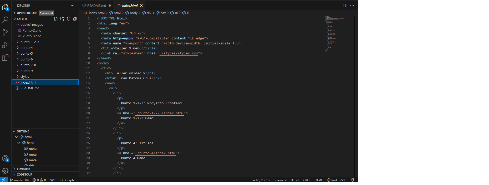
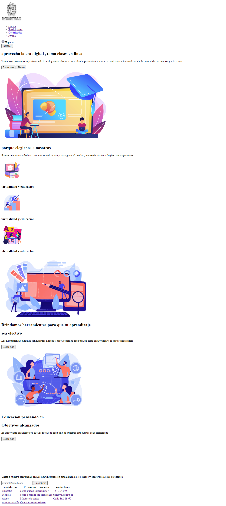
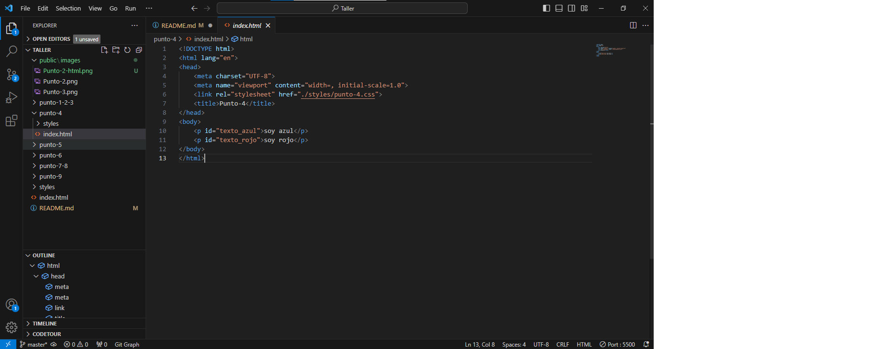
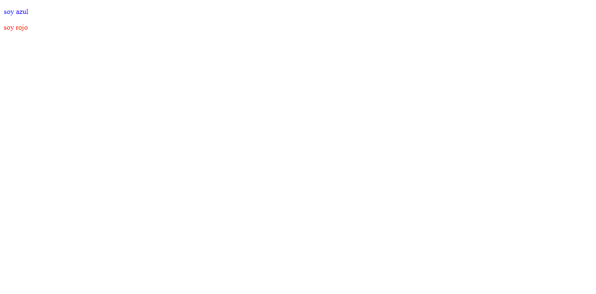
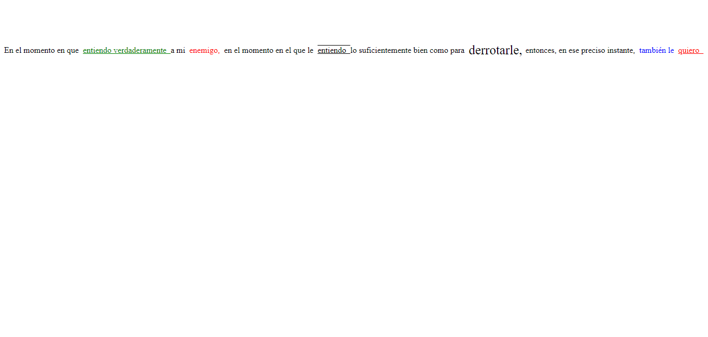
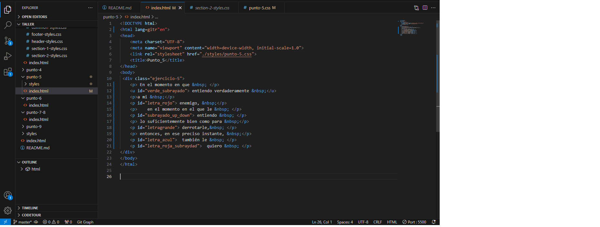
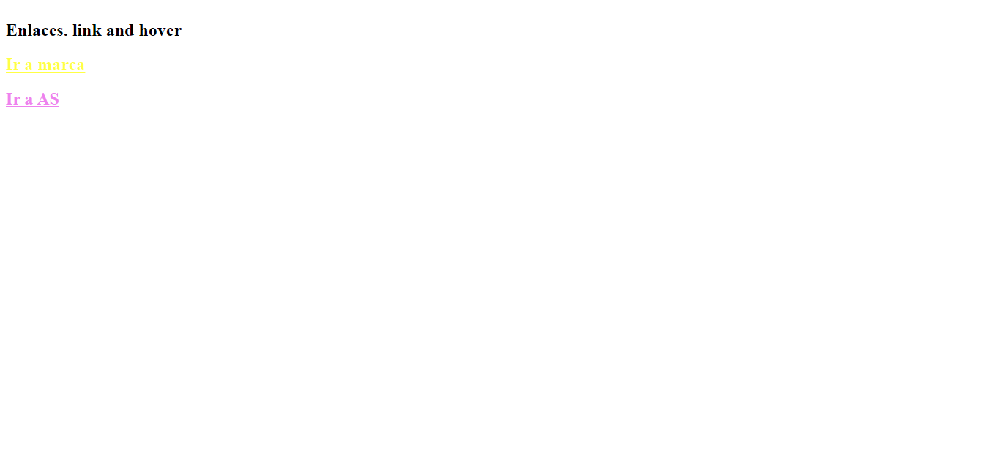
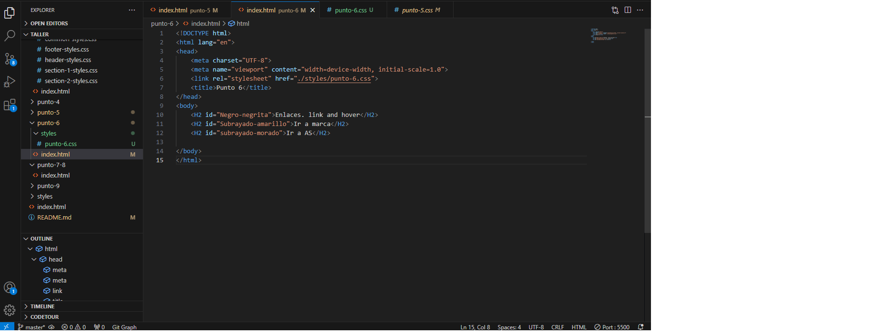
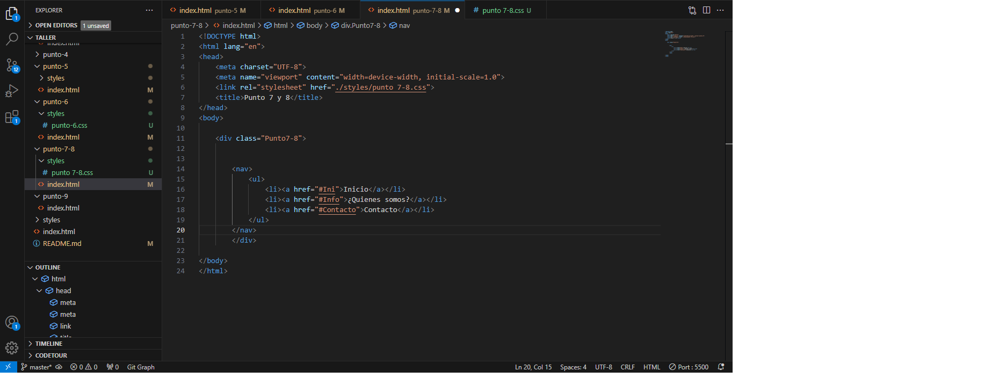

<h1>Taller 9 Wilfran Matoma Cruz</h1>
<h2>Información</h2>

Grupo Full Stack basico-Grupo 1

Profesor: Cristian Patiño

<h2>Link de la pagina web</h2> 
<a ref="https://wilfran900420.github.io/taller-9-full-stack/"> Link de pagina web </a>

<h2>Link de figma</h2>  

<a ref="https://www.figma.com/file/h3JTbaHWwvWJzxiEmMH9JL/Wilfran-Matoma-Cruz?type=design&node-id=0%3A1&mode=design&t=aTPSPNassyJDBq5D-1"> Link de figma </a>

<h2>Punto 2: Diseño en HTML</h2> 

<h2>Punto 3: Diseño con CSS</h2>  

<h2>Punto 4: Titulos</h2>

<h2>Punto 5: Parrafos</h2>  

<h2>Parrafo 6: links</h2>

<h2>Punto 7 y 8: Navegación</h2>

<h2>Punto 9: Tabla</h2>

